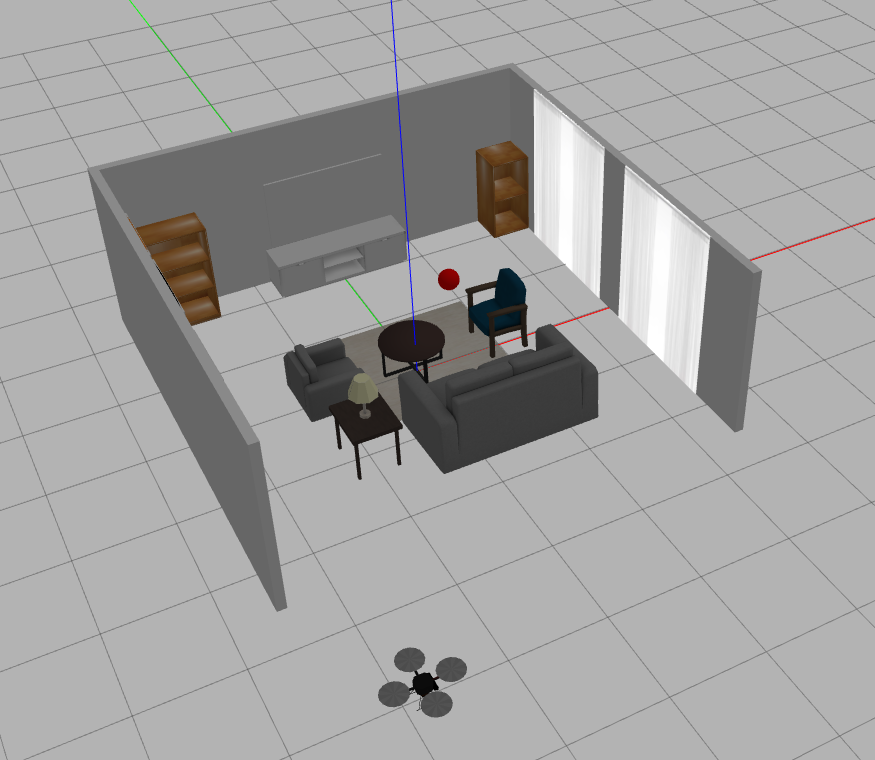

# Hector-quadrotor

This is repo dedicated to experiments using the classic Hector quad rotor simulation. As a base I have used [hector-quadrotor-noetic](https://github.com/RAFALAMAO/hector-quadrotor-noetic/tree/main) and [TheConstuctCore](https://bitbucket.org/theconstructcore/workspace/repositories/) repositories in GitLab. The simulation has been tested in ROS Noetic and Gazebo Classic 11.15.



## Helpful launch files

### Start simulations
Start simulation in empty world
```
roslaunch hector_quadrotor_gazebo quadrotor_empty_world.launch
```

Start simulation in outdoor world
```
roslaunch hector_quadrotor_demo outdoor_flight_gazebo_no_rviz.launch
```

Start simulation in a livining room (including the takeoff/land plugin)
```
roslaunch hector_quadrotor_gazebo quadrotor_living_room.launch
```


### Control
Start hector-ui
```
roslaunch hector_ui hector_ui.launch
```

Start keyboard teleoparation
```
roslaunch turtlebot_teleop keyboard_teleop.launch
```

Enable takeoff/landing behaviour
```
roslaunch takeoff_land take0ff_land.launch
```


### RTAB-Map
Start rtab-map mapping
```
roslaunch my_rtab_package rtabmap_drone_mapping.launch
```

Start rtab-map localisation
```
roslaunch my_rtab_package rtabmap_drone_localisation.launch
```